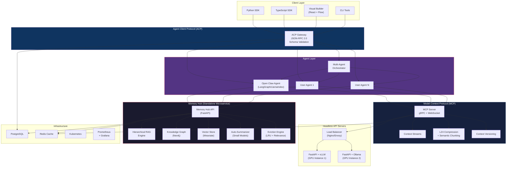
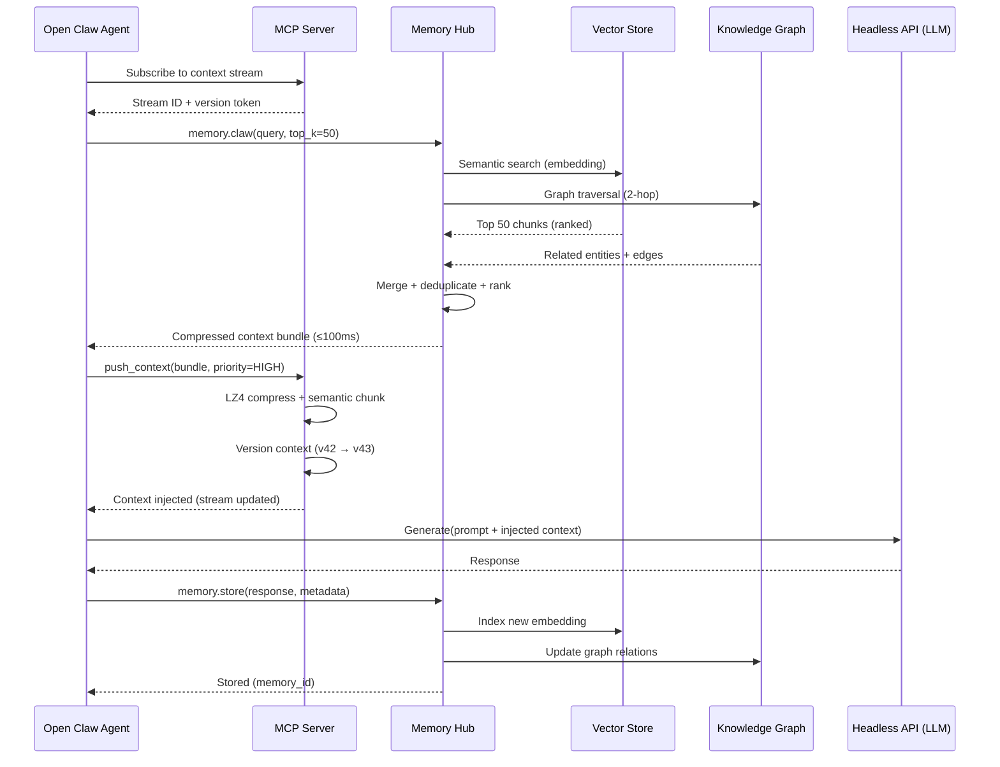
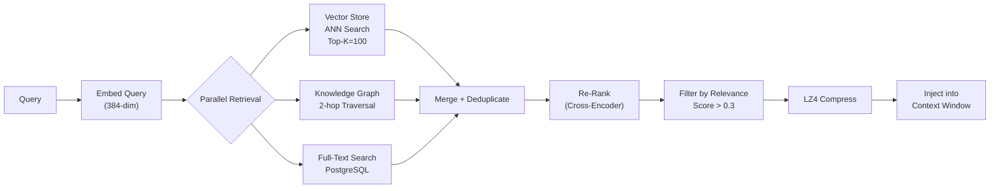
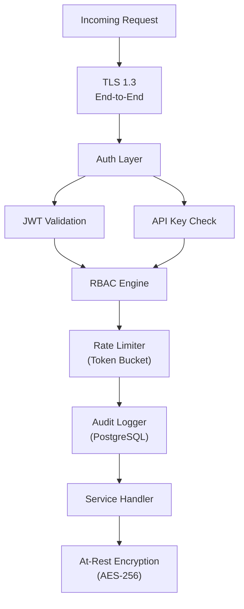
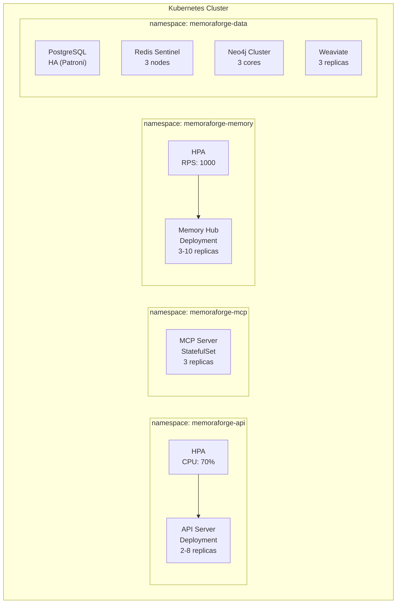

# MemoraForge — Production Architecture

## High-Level System Diagram

## Context Flow — How Agents See 5M+ Tokens

## Memory Clawing — Retrieval Pipeline

## Component Specifications

### 1. Headless API Server
- **Runtime**: FastAPI 0.115+ on Uvicorn (Python 3.12)
- **Model backends**: vLLM (GPU), Ollama (CPU/edge)
- **Scaling**: Horizontal via K8s HPA (CPU/GPU metrics)
- **Endpoints**: `/v1/completions`, `/v1/chat`, `/v1/embeddings`
- **Latency target**: P99 < 200ms for embeddings, < 2s for generation

### 2. MCP Server (Model Context Protocol)
- **Transport**: gRPC (inter-service) + WebSocket (agent-facing)
- **Compression**: LZ4 real-time + semantic chunking (512-token windows)
- **Versioning**: Append-only log, snapshot every 100 versions
- **Stream model**: Pub/sub — agents subscribe to named streams
- **Max stream size**: 5M tokens (effective), 128K injected per LLM call

### 3. ACP Handler (Agent Client Protocol)
- **Protocol**: JSON-RPC 2.0 over WebSocket
- **Schema**: JSON Schema validation on every request/response
- **Methods**: `agent.register`, `agent.invoke`, `memory.claw`, `memory.store`, `context.subscribe`, `orchestrator.dispatch`
- **Auth**: JWT + API key dual authentication
- **Rate limits**: Token bucket per agent (configurable)

### 4. Memory Hub
- **Type**: Standalone FastAPI microservice
- **Vector store**: Weaviate (self-hosted) — 384-dim embeddings
- **Knowledge graph**: Neo4j 5.x — entities + relations
- **Relational**: PostgreSQL 16 — metadata, audit logs
- **Cache**: Redis 7 — hot path caching, LRU eviction
- **Retrieval**: Hierarchical RAG (document → section → chunk)
- **Summarization**: Runs smaller model (Phi-3 / Mistral-7B) for auto-summarization
- **Eviction**: Combined LRU + relevance decay scoring
- **SLA**: P99 retrieval < 100ms for 5M token corpus

### 5. Open Claw Agent
- **Framework**: LangGraph (state machine) + LlamaIndex (retrieval)
- **Shadow memory**: Each agent maintains persistent state in Memory Hub
- **Capabilities**: Web scraping, file ingestion, API calls, code execution
- **Extensibility**: Plugin system for custom tools

## Security Architecture

## Kubernetes Deployment

## Cost Estimates (Monthly, Production)

| Component | Spec | Est. Cost |
|-----------|------|-----------|
| API Servers (2x A100 GPU) | vLLM inference | $6,000 |
| MCP Server (3x c6i.2xlarge) | gRPC + streaming | $900 |
| Memory Hub (3x r6i.2xlarge) | RAG + retrieval | $1,200 |
| Neo4j (3-core cluster) | Knowledge graph | $800 |
| Weaviate (3x r6i.xlarge) | Vector search | $600 |
| PostgreSQL (db.r6g.xlarge HA) | Metadata | $500 |
| Redis (r6g.large sentinel) | Caching | $300 |
| K8s control plane + networking | EKS | $400 |
| **Total** | | **~$10,700/mo** |

## 4-Week Implementation Roadmap

### Week 1: Foundation
- [ ] Memory Hub core: vector store integration, basic CRUD
- [ ] MCP Server: WebSocket transport, LZ4 compression
- [ ] ACP Handler: JSON-RPC 2.0 skeleton, schema validation
- [ ] Docker Compose for local dev stack

### Week 2: Intelligence
- [ ] Hierarchical RAG pipeline in Memory Hub
- [ ] Knowledge graph integration (Neo4j)
- [ ] Context versioning in MCP
- [ ] Auto-summarization pipeline
- [ ] Headless API server with vLLM/Ollama backends

### Week 3: Agents & Orchestration
- [ ] Open Claw Agent with LangGraph state machine
- [ ] Shadow memory integration
- [ ] Multi-agent orchestrator
- [ ] Python SDK (core methods)
- [ ] TypeScript SDK (core methods)

### Week 4: Production Hardening
- [ ] End-to-end encryption + RBAC
- [ ] Rate limiting + audit logging
- [ ] Kubernetes manifests + Helm charts
- [ ] Load testing (target: 1000 RPS retrieval)
- [ ] Visual Builder UI (React + Flow)
- [ ] Documentation + examples

## Edge Cases & Error Handling

| Scenario | Handling |
|----------|----------|
| Context overflow (>128K for LLM call) | MCP auto-truncates by priority score, keeps system prompt + recent context |
| Stale memory | Relevance decay: score *= 0.95^(days_since_access); evict below 0.1 |
| Vector store timeout | Circuit breaker (3 failures → fallback to FTS-only for 30s) |
| Neo4j partition | Read from nearest replica; queue writes for reconciliation |
| Embedding model drift | Version all embeddings; re-index pipeline on model change |
| Agent crash mid-memory-write | Write-ahead log in Redis; replay on agent restart |
| Concurrent memory updates | Optimistic locking with version vectors per memory shard |
| LLM rate limit hit | Exponential backoff + queue with priority (paid > free tier) |

## Optimization Tricks

1. **Quantization**: GPTQ/AWQ 4-bit for inference models; full precision only for embedding
2. **Caching layers**: Redis L1 (hot, 1min TTL) → PostgreSQL L2 (warm) → Weaviate L3 (cold)
3. **Parallel retrieval**: Fan-out to VS + KG + FTS simultaneously, merge results
4. **Semantic chunking**: Sentence-boundary aware splitting (not fixed-size)
5. **Embedding cache**: Hash query → cached embedding (Redis, 24h TTL)
6. **Batch embedding**: Accumulate queries, batch embed every 50ms
7. **Connection pooling**: asyncpg pool (min=10, max=50) for PostgreSQL
8. **Pre-fetch**: Predict next likely queries from conversation flow, pre-warm cache
